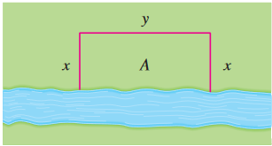

## ¿Qué es optimización?
 Cuando hablamos de optimización hablamos de llevar acabo una tarea de la mejor forma posible, de la forma óptima, ya sea, por ejemplo, encontrando el precio de venta que maximiza las ganancias en la venta de un producto, o la relacion de oxígeno y combustible que minimiza el tiempo necesario para llevar una caldera a una temperatura deseada. El cálculo es una herramienta poderosa para la optimización, podemos modelar problemas de la vida real en funciones, ecuaciones y relaciones, y usar lo que hemos aprendido para encontrar los valores extremos de estas funciones y encontrar los valores que optimizan nuestro problema. 

La optimización en cálculo es un área donde lo más importante es el planteamiento, análisis y comprensión del problema, y el saber modelar dicho problema en ecuaciones matemáticas, por lo cual los desarrollos y operaciones matemáticas serán breves en este material.

### Pasos para resolver un problema de optimización

- **Analizar y comprender el problema.** No se puede resolver aquello que no se entiende. Analizar la información que se tiene detenidamente y reconocer lo que se está intentando hacer, la forma en que debe optimizarse, la cantidad que se está optimizando, los datos que se tienen del problema y su relación con la cantidad a optimizar. Para esto es muy importante tener un diagrama o un dibujo del problema.
- **Encontrar la ecuación principal.** Es la ecuación con la que trabajaremos. Si estamos máximizando ganancias, necesitamos una ecuación de ganancias; si estamos minimizando tiempo, necesitamos una ecuación de tiempo. Debemos identificar la cantidad que estamos tratando de optimizar, y encontrar una ecuación para dicha cantidad.
- **Encontrar ecuaciones y relaciones relevantes para el problema.** Son las que nos darán la información extra necesaria para manipular la ecuación principal. Si estamos minimizando el costo de producción de un tanque, necesitaremos su ecuación de costo, pero también podría ser necesario su ecuación de volumen y de área, pues de estas dependerá el costo.
- **Expresar la ecuación principal como función de una variable.** Para encontrar sus valores máximos y mínimos necesitamos una función que sea derivable con respecto a una sola variable. Si la ecuación principal resulta en una ecuación de más de una variable use las ecuaciones y relaciones del paso anterior para expresar la ecuación principal en términos de una variable.
- **Examine los puntos extremos de la ecuación principal.** Usaremos lo que se ha aprendido para hallar los puntos críticos, máximos y mínimos de la ecuación para resolver el problema.

Apliquemos esto a un problema:

### Problemas de optimización

**Ejemplo 1.**

Una parcela rectangular en una granja tendrá límites, por un lado, por un río, y por los otros tres mediante una cerca electrificada con un solo alambre. Si se cuenta sólo con 800 m de alambre, ¿cuál es la mayor área que puede ocupar la parcela y cuáles son sus dimensiones?

Primeramente analicemos el problema. Nos piden hallar la mayor área posible que pueda tener la parcela, por lo que podemos identificar que lo que se pide es máximizar un área, para lo cual necesitamos una ecuación de área, esta será nuestra ecuación principal. Antes de continuar hagamos un dibujo del problema para visualizarlo mejor:

<figure>

<figcaption>Fig 1. Ilustración del problema.</figcaption>
</figure>

Nos dicen que la parcela con la que estamos trabajando tiene forma de rectangulo: si vemos a la parcela como un rectángulo de altura $$x$$ y de base $$y$$ al que le falta uno de sus lados de longitud $$y$$, podemos modelar ecuaciones matemáticas que se apliquen al problema. Al ser rectangular, la parcela debe tener el área de un rectángulo, el producto de su base y su altura, de modo que su ecuación de área será:

$$
\begin{equation*}
	A = xy
\end{equation*}
$$

Nos dicen que la cerca está hecha de alambre y que contamos con 800 metros del mismo. Es importante considerar si es necesario usar todo el alambre que se tiene, sin embargo estamos maximizando el área y esta es directamente proporcional a la longitud de los lados del rectangulo, los cuales estan hechos de alambre, por lo que queda claro que debemos usar todo el alambre disponible en nuestros cálculos para lograr la mayor área.

Notemos cómo $$A$$ está en función de $$x$$ y $$y$$, es decir, es una función de dos variables:

$$
\begin{equation*}
	A(x,y) = xy
\end{equation*}
$$

Al tener una función de dos variables no podemos hallar aún sus valores extremos porque no es derivable con respecto a una variable, sea $$x$$ o $$y$$. Debemos hallar alguna otra relación en el problema que nos permita reemplazar alguna de las variables en función de la otra. Volvamos a ver la imagen.

A partir de la forma rectangular de la parcela y conociendo solamente sus lados, podemos también conseguir la ecuación de su perímetro, el cual, a su vez, es relevante para el problema, pues los lados del rectángulo están hechos de alambre, y la cantidad de alambre disponible es un factor limitante en nuestro problema. Ya que el rectangulo tiene solamente un lado de longitud $$y$$ y dos de longitud $$x$$, podemos decir que su perímetro es:

$$
\begin{equation*}
	P = 2x + y
\end{equation*}
$$

Podría parecer que acabamos de complicar más el problema añadiendo una nueva variable $$P$$, sin embargo $$P$$ es el perímetro, y antes hemos descubierto que el perímetro es la cantidad de alambre que se usará y que usaríamos la totalidad de los 800 metros, de modo que podemos reemplazarlo en la ecuación:

$$
\begin{align*}
	800 &= 2x + y
	\\\\\rightarrow
	2x + y &= 800
\end{align*}
$$

Aquí podemos tomar dos caminos, ambos válidos, despejar $$y$$ en función de $$x$$ y reemplazar en $$A(x,y)$$ para tener una ecuación $$A(x)$$, o despejar $$x$$ en función de $$Y$$ y conseguir una $$A(y)$$. Aquí tomaremos la primera opción porque es la que resulta en una expresión más sencilla, pero ambas formas son válidas y llevan al mismo resultado.

Así que despejaremos $$y$$ y lo reemplazaremos en $$A(x,y) = xy$$ para conseguir una $$A(x)$$:

$$
\begin{align*}
	2x + y &= 800
	\\\\\rightarrow
	y &= 800 - 2x
	\\\\
	A(x,y) &= xy
	\\\\\rightarrow
	A(x) &= x(800 - 2x)
	\\\\\rightarrow
	A(x) &= 800x - 2x^2
\end{align*}
$$

Esto que acabamos de hacer es el paso más importante de todo el proceso, porque no sólo hemos convertido una ecuación de dos variables en una función de una sola, la cual es apta para que podamos trabajarla, sino que además conseguimos la ecuación del área que aplica específicamente a nuestro problema particular. Fíjese, $$A(x,y) = xy$$ no es una ecuación que aplica solamente a nuestro caso, sino a cualquier rectángulo posible de base $$x$$ y altura $$y$$, por muy diferente que sea al nuestro, pero al haber reemplazado la $$y$$ usando la ecuación del perímetro $$P = 2x + y$$ y la límitación $$800 = 2x + y$$, fundamentalmente hemos logrado \textit{adaptar} una ecuación de área de un rectángulo cualquiera, a una ecuación de área de nuestra parcela, la cual tiene forma de rectángulo y cuya ecuación de perímetro es $$P = 2x + y$$, y cuyo perimetro es de 800 metros, porque esa es la longitud de alambre que tenemos para nuestra parcela. Con dos ecuaciones, un despeje y un reemplazo hemos conseguido adaptar una ecuación general de área de un rectángulo, a la ecuación del área de nuestro problema partícular de la parcela.\footnote{Que bellas que son las matemáticas.}

Adicionalmente podemos analizar a $$A(x)$$ y notar que es una parábola, por lo cual tiene un valor extremo absoluto, y al notar que la parte cuadrática de la función $$-2x^2$$ es negativa, podemos saber que es una parábola que abre hacia abajo, por lo tanto el valor extremo absoluto es un máximo absoluto, justo lo que estamos buscando.

Ahora podemos usar lo aprendido y encontrar los valores extremos de $$A(x)$$. Derivemos:

$$
\begin{align*}
	A(x) &= 800x - 2x^2
	\\\\\rightarrow
	A'(x) &= 800 - 4x
\end{align*}
$$

Igualamos a cero y despejamos $$x$$:

$$
\begin{align*}
	0 &= 800 - 4x
	\\\\\rightarrow
	0 &= 800 - 4x
	\\\\\rightarrow
	4x &= 800
	\\\\\rightarrow
	x &= \frac{800}{4}
	\\\\\rightarrow
	x &= 200
\end{align*}
$$

200 metros es la altura del rectángulo necesaria para lograr máxima área en nuestra parcela; ahora usemos relaciones anteriores para hallar $$y$$ y $$A$$:

$$
\begin{align*}
	y &= 800 - 2x
	\\\\\rightarrow
	y &= 800 - 2(200)
	\\\\\rightarrow
	y &= 800 - 400
	\\\\\rightarrow
	y &= 400
	\\\\
	A(x,y) &= xy
	\\\\\rightarrow
	A(200,400) &= (200)(400)
	\\\\\rightarrow
	A(200,400) &= 80000
\end{align*}
$$

Como resultado tenemos que nuestro rectángulo tiene como dimensiones 200 metros de ancho, 400 metros de largo, y logra $$80.000m^2$$ de área, y esta es el área máxima posible.
